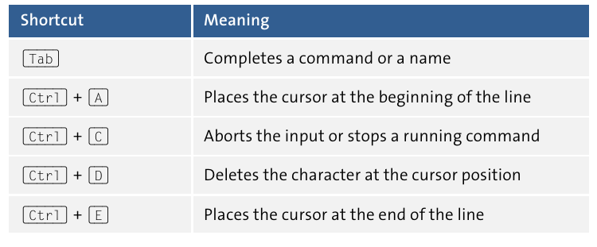
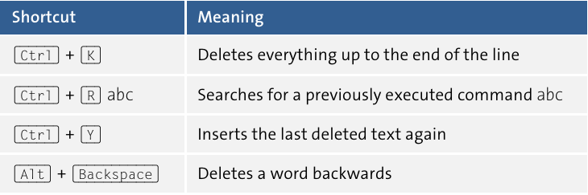
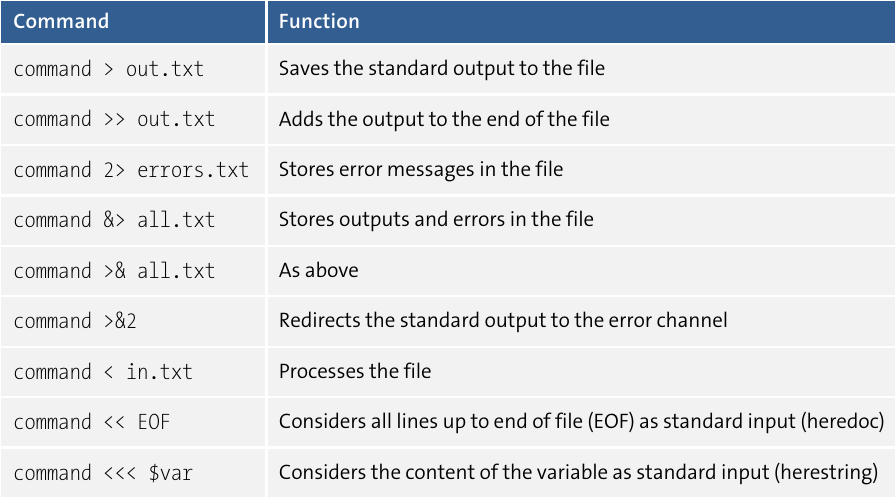
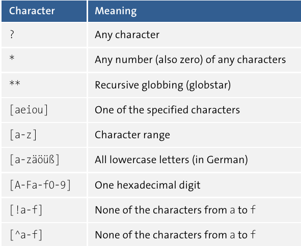
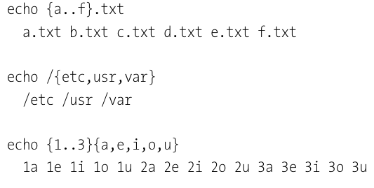

# Scripting - Automation with Bash, PowerShell and Python

## Chapter 3 - Bash and Zsh

### 3.3.1 Operating the Terminal

#### Keyboard Shortcuts




### 3.3.2 Online Help

```man <command>``` displays a longer info text for many commands. Thus, ```man ls``` explains
how to use the ```ls``` command and what options are available. You can navigate through
the multi-page text using the cursor keys. The space bar scrolls down an entire page.
Using **/** you can search for an expression in the help text. **N** jumps to the next
search result if necessary, and **Q** closes the help interface.

### 3.5.1 Hash Bang (Shebang)

The first line of a script to be executed on Linux or macOS must start with the characters, **#** (“hash” or “sharp”)
and **!** (“bang”) as well as the path of the interpreter. “Shebang”
is a linguistic shortening of “sharp bang.”

On Linux, the Bash program is predominantly installed in the /bin directory. Thus, a
Bash script starts with the following line:

```#!/bin/bash```

If you want your script to work regardless of whether Bash or Zsh is available, the following hash bang will get 
you there:

```#!/bin/sh```

### 3.7.1 Redirecting Input and Output

#### Operators for Redirecting Input and Output



### 3.8 Globbing, Brace Extension, and Handling File and Directory Names

#### Globbing Characters



### 3.8.3 Brace Extension

In Bash, you can formulate enumerations separated by commas or ranges created via
```..``` in curly brackets. Before the command gets executed, all possible combinations are
created, so the expression specified in parentheses is “expanded.” Unlike globbing, however, the brace extension does not consider whether corresponding files already
exist or not. The easiest way to understand the mechanism is by looking at some examples:


